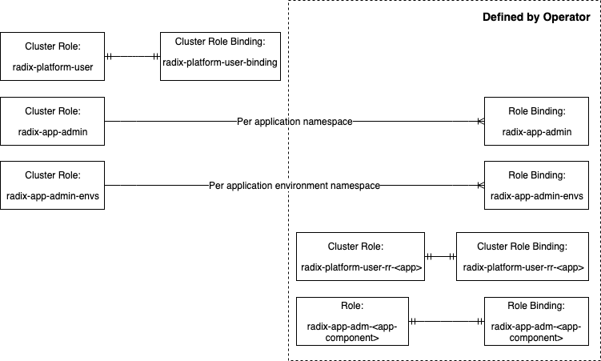
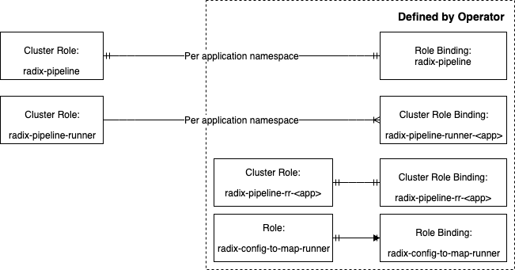
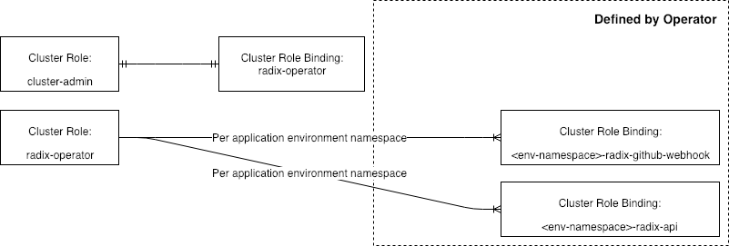

# RBAC

## Radix Platform User perspective

- Clusterroles
  - radix-platform-user
    - Purpose: defines what global access a platform user will have. Currently the only access granted 
    will be to define new Radix application
    - Created by: Helm chart
    - Cluster role binding: radix-platform-user-binding
    - Accesses:
      - Create RRs
      - List RAs 1
      - List RDs 1
      - List jobs 1
      - List ingresses 1
  - radix-app-admin
    - Purpose: grants access to manage the CI/CD of their applications
    - Created by: Helm chart
    - Role binding: radix-app-admin
    - Accesses:
      - Get and list RAs
      - Get and list pods
      - Get and list pod logs
      - Get, list, create and delete 1 jobs
  - radix-app-admin-envs:
    - Purpose: grants access to manage their running Radix applications
    - Created by: Helm chart
    - Role binding: radix-app-admin-envs
    - Accesses:
      - Get, list, create and delete RDs
      - Get, list and delete1 deployments
      - Get, list and delete1 pods
      - Get, list and delete1 pod logs
      - Get, list and delete1 services
      - Get and list ingresses
      - Create secrets
  - radix-platform-user-rr-\<app\>
    - Purpose: control access to manage the specifc RR for the \<app\>
    - Created by: Operator
    - Cluster Role binding: radix-platform-user-rr-\<app\>
    - Accesses:
      - Get, list, update, patch and delete RR of \<app\>

- Roles
  - radix-app-adm-\<app-component\>
    - Purpose: grant access to manage secrets in environment namespace for a specific \<app-component\>
    - Lives in: environment namespace
    - Created by: Operator
    - Role binding: radix-app-adm-\<app-component\>
    - Accesses:
      - Get, list, update, patch and delete secret of \<app-component\>

- Clusterrole bindings
  - radix-platform-user-binding
    - Purpose: Gives global access for Radix User ad group through radix-platform-user clusterrole
    - Created by: Helm chart
  - radix-platform-user-rr-\<app\>
    - Purpose: Grants access to specific RR through radix-platform-user-rr-\<app\> clusterrole given by ad-group defined in RR for specific \<app\>
    - Created by: Operator

- Role bindings
  - radix-app-admin
    - Purpose: Grants access through radix-app-admin clusterrole to ad-group defined in RR to manage specific \<app\>
    - Lives in: app namespace
    - Created by: Operator
  - radix-app-admin-envs
    - Purpose: Grants access throuh radix-app-admin-envs clusterrole to ad-group defined in RR for a specific \<app\>
    - Lives in: environment namespace
    - Created by: Operator
  - radix-app-adm-\<app-component\>
    - Purpose: Grants access to secret through radix-app-adm-\<app-component\> role given by ad-group defined in RR for specific \<app\>
    - Lives in: environment namespace
    - Created by: Operator

## Radix Platform developer perspective

- Clusterrole bindings
  - radix-cluster-admins
    - Purpose: Grants full access to administer cluster through the cluster-admin clusterrole for the platform developer
    - Lives in: default namespace

## System User (Service Account) perspective

- Pipeline

  - Clusterroles
    - radix-pipeline 2
      - Purpose: Role to update the radix config from repo and execute the outer pipeline
      - Created by: Helm chart
      - Role binding: radix-pipeline
      - Accesses:
        - Get, list, create and delete RAs
        - Get, list and create jobs
        - Get and list configmaps 4
    - radix-pipeline-runner 2
      - Purpose: Create environment namespaces and make deployments
      - Created by: Helm chart
      - Cluster role binding: radix-pipeline-runner-\<app\>
      - Accesses:
        - Get, list and create namespaces
        - Get and create RDs
    - radix-pipeline-rr-\<app\>
      - Purpose: Get access to read RR belonging to \<app\>
      - Created by: Operator
      - Cluster Role binding: radix-pipeline-rr-\<app\>
      - Accesses:
        - Get RR for \<app\>

  - Clusterrole bindings
    - radix-pipeline-runner-\<app\>
      - Purpose: Give radix-pipeline service account inside app namespace access to creating namespaces and make deployments through radix-pipeline-runner clusterrole
      - Created by: Operator
    - radix-pipeline-rr-\<app\>
      - Purpose: Give radix-pipeline service account inside app namespace access to read RR belonging to \<app\> through radix-pipeline-\<app\> clusterrole
      - Created by: Operator
      
  - Role bindings
    - radix-pipeline
      - Purpose: Give radix-pipeline service account inside app namespace access to update radix config and execute the outer pipeline through the radix-pipeline clusterrole
      - Lives in: app namespace
      - Created by: Operator

- Operator

  - Clusterroles
    - RadixReader, RadixSecretReader and RadixAppAdmin 3
    - radix-operator
      - Purpose: Give access all operations needed to fully operate the platform
      - Created by: Helm chart
      - Cluster role binding: \<env-namespace\>-radix-github-webhook and \<env-namespace\>-radix-api
      - Accesses:
        - All access to RAs and RDs
        - Get and list RRs
        - Get list and create jobs
        - Get and list ingresses
        - Get and list configmaps 4
  - Clusterrole bindings
    - radix-operator
      - Purpose: Give access all operations needed to fully operate the platform through the cluster-admin 5 clusterrole
      - Created by: Helm chart
- Webhook
  - Clusterrole bindings
    - \<env-namespace\>-radix-github-webhook
      - Purpose: Give access to read RAs and trigger jobs through the radix-operator clusterrole
      - Created by: Operator
- API
  - Clusterrole bindings
    - \<env-namespace\>-radix-api
      - Purpose: Give access to perform all required operations through the radix-operator clusterrole
      - Created by: Operator

1 Should be reviewed, as this access might not be needed. Ref. [RA-108 Deny platform users listing jobs across namespaces](https://equinor.atlassian.net/browse/RA-108)

2 radix-pipeline-runner will be removed if we move RDs into app namespace.
radix-pipeline will need to be extended with ability to create RDs in app namespace. Ref. [RA-55 Deny Platform users listing deployments across namespaces](https://equinor.atlassian.net/browse/RA-55)

3 Should be removed as they appear not to be used. Ref. [RA-182 Remove unused clusterroles RadixReader, RadixSecretReader and RadixAppAdmin](https://equinor.atlassian.net/browse/RA-182)

4 Will be redundant if we move to use environment variables entirely to control the operator. Ref. [RA-145 Technical: Create a configmap for global cluster settings which the operator can use](https://equinor.atlassian.net/browse/RA-145)

5 Should have been linked to radix-operator cluster role. Ref. [RA-86 radix-operator clusterrolebinding is linked to cluster-admin clusterrole](https://equinor.atlassian.net/browse/RA-86)
