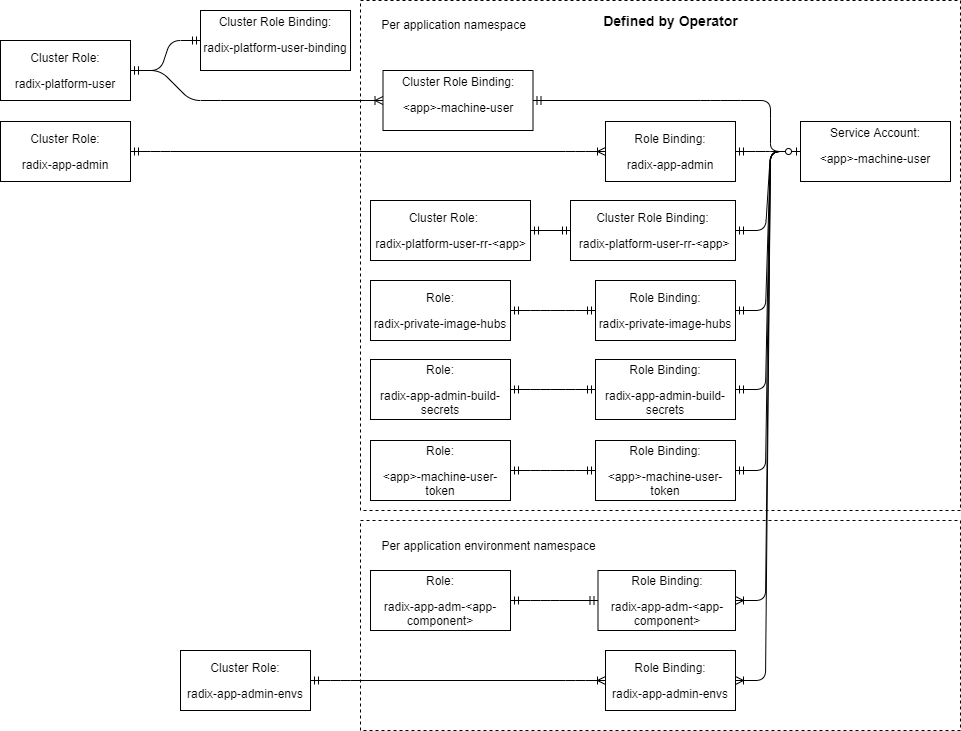

# RBAC

## Radix Platform User perspective

See table 1.3 for complete listing of permissions

### Service account

- \<app\>-machine-user
  - Representation of an app admin for the single application, with equal access to administer the application

### Clusterroles

- radix-platform-user
  - Purpose: defines what global access a platform user will have. Currently the access granted will be to define new Radix application, new SubjectAccessReview, update radixjobs and to read various resources.
  - Created by: Helm chart
  - Cluster role binding:
    - radix-platform-user-binding given to all users
    - `application`-machine-user given to all service-accounts
- radix-app-admin
  - Purpose: grants access to manage the CI/CD of their applications
  - Created by: Helm chart
  - Role binding: radix-app-admin given to all users and service-accounts
- radix-app-admin-envs:
  - Purpose: grants access to manage their running Radix applications, create secrets, create and delete radixdeployments and related resources
  - Created by: Helm chart
  - Role binding: radix-app-admin-envs
- radix-platform-user-rr-\<app\>
  - Purpose: control access to manage the specifc RR for the \<app\>
  - Created by: Operator
  - Cluster Role binding: radix-platform-user-rr-\<app\>

### Roles

- radix-app-adm-\<app-component\>
  - Purpose: grant access to manage secrets in environment namespace for a specific \<app-component\>
  - Lives in: environment namespace
  - Created by: Operator
  - Role binding: radix-app-adm-\<app-component\>

### Clusterrole bindings

- radix-platform-user-binding
  - Purpose: Gives global access for Radix User ad group through radix-platform-user clusterrole
  - Created by: Helm chart
- radix-platform-user-rr-\<app\>
  - Purpose: Grants access to specific RR through radix-platform-user-rr-\<app\> clusterrole given by ad-group defined in RR for specific \<app\>
  - Created by: Operator
- \<app\>-machine-user
  - Purpose: Gives global access for \<app\>-machine-user service account through radix-platform-user clusterrole

### Role bindings

- radix-app-admin
  - Purpose: Grants access through radix-app-admin clusterrole to ad-group defined in RR to manage specific \<app\>
  - Lives in: app namespace
  - Created by: Operator
- radix-app-admin-envs
  - Purpose: Grants access throuh radix-app-admin-envs clusterrole to ad-group defined in RR for a specific \<app\>
  - Lives in: environment namespace
  - Created by: Operator
- radix-app-adm-\<app-component\>
  - Purpose: Grants access to secret through radix-app-adm-\<app-component\> role given by ad-group defined in RR for specific \<app\>
  - Lives in: environment namespace
  - Created by: Operator

## Radix Platform developer perspective

See table 1.3 for complete listing of permissions

### Clusterrole bindings

- radix-cluster-admins
  - Purpose: Grants full access to administer cluster through the cluster-admin clusterrole for the platform developer
  - Lives in: default namespace

## System User (Service Account) perspective

### Pipeline

#### Clusterroles

- radix-pipeline 2
  - Purpose: Role to update the radix config from repo and execute the outer pipeline
  - Created by: Helm chart
  - Role binding: radix-pipeline
- radix-pipeline-runner 2
  - Purpose: Create environment namespaces and make deployments
  - Created by: Helm chart
  - Cluster role binding: radix-pipeline-runner-\<app\>
- radix-pipeline-rr-\<app\>
  - Purpose: Get access to read RR belonging to \<app\>
  - Created by: Operator
  - Cluster Role binding: radix-pipeline-rr-\<app\>

#### Roles

- radix-config-to-map-runner
  - Purpose: Role to run cloning of radixconfig from master branch and to put into temporary config map
  - Lives in: app namespace
  - Created by: Operator
  - Role binding: radix-config-to-map-runner

#### Clusterrole bindings

- radix-pipeline-runner-\<app\>
  - Purpose: Give radix-pipeline service account inside app namespace access to creating namespaces and make deployments through radix-pipeline-runner clusterrole
  - Created by: Operator
- radix-pipeline-rr-\<app\>
  - Purpose: Give radix-pipeline service account inside app namespace access to read RR belonging to \<app\> through radix-pipeline-\<app\> clusterrole
  - Created by: Operator

#### Role bindings

- radix-pipeline
  - Purpose: Give radix-pipeline service account inside app namespace access to update radix config and execute the outer pipeline through the radix-pipeline clusterrole
  - Lives in: app namespace
  - Created by: Operator
- radix-config-to-map-runner
  - Purpose: Give radix-config-to-map-runner service account inside app namespace access to create config map where a clone of radixconfig from master branch is put
  - Lives in: app namespace
  - Created by: Operator

### Operator

#### Clusterroles

- radix-operator

  - Purpose: Give access all operations needed to fully operate the platform
  - Created by: Helm chart
  - Cluster role binding: radix-operator

#### Clusterrole bindings

- radix-operator
  - Purpose: Give access all operations needed to fully operate the platform through the radix-operator clusterrole
  - Created by: Helm chart

### Webhook

#### Clusterroles

- radix-webhook
  - Purpose: Give access all operations needed to fully operate the radix-webhook
  - Created by: Helm chart
  - Cluster role binding: \<env-namespace\>-radix-github-webhook

#### Clusterrole bindings

- \<env-namespace\>-radix-github-webhook
  - Purpose: Give access to read RAs and trigger jobs through the radix-webhook clusterrole
  - Created by: Operator

### API

#### Clusterroles

- radix-api
  - Purpose: Give access all operations needed to fully operate the radix-api
  - Created by: Helm chart
  - Cluster role binding: \<env-namespace\>-radix-api

#### Clusterrole bindings

- \<env-namespace\>-radix-api
  - Purpose: Give access to perform all required operations through the radix-api clusterrole
  - Created by: Operator

1 Should be reviewed, as this access might not be needed. Ref. [RA-108 Deny platform users listing jobs across namespaces](https://equinor.atlassian.net/browse/RA-108)

2 radix-pipeline-runner will be removed if we move RDs into app namespace.
radix-pipeline will need to be extended with ability to create RDs in app namespace. Ref. [RA-55 Deny Platform users listing deployments across namespaces](https://equinor.atlassian.net/browse/RA-55)

3 Will be redundant if we move to use environment variables entirely to control the operator. Ref. [RA-145 Technical: Create a configmap for global cluster settings which the operator can use](https://equinor.atlassian.net/browse/RA-145)

## Tables of rolebindings and permissions

These tables are at this moment manually created and maintained and can become outdated in relation to currently active clusters.

#### Table 1.1 Roles and Bindings

Account-ns|Account|Role|Role-Type|Binding-ns|Binding|Binding-Type
--|--|--|--|--|--|--
application|`application`-machine-user|radix-platform-user|clusterrole|global|`application`-machine-user|clusterrolebinding
application|`application`-machine-user|radix-platform-user-rr-`application`|clusterrole|global|radix-platform-user-rr-`application`|clusterrolebinding
application|`application`-machine-user|radix-app-admin|clusterrole|application|radix-app-admin|rolebinding
application|`application`-machine-user|radix-app-admin-envs|clusterrole|environment|radix-app-admin-envs|rolebinding
application|`application`-machine-user|radix-app-adm-`component`|role|environment|radix-app-adm-`component`|rolebinding
application|`application`-machine-user|radix-private-image-hubs|role|application|radix-private-image-hubs|rolebinding
application|`application`-machine-user|radix-app-admin-build-secrets|role|application|radix-app-admin-build-secrets|rolebinding
application|`application`-machine-user|`application`-machine-user-token|role|application|`application`-machine-user-token|rolebinding
||AD-groups|radix-platform-user-rr-`application`|clusterrole|global|radix-platform-user-rr-`application`|clusterrolebinding
||AD-groups|radix-app-admin|clusterrole|application|radix-app-admin|rolebinding
||AD-groups|radix-app-admin-envs|clusterrole|environment|radix-app-admin-envs|rolebinding
||AD-groups|radix-app-adm-`component`|role|environment|radix-app-adm-`component`|rolebinding
||AD-groups|radix-private-image-hubs|role|application|radix-private-image-hubs|rolebinding
||AD-groups|radix-app-admin-build-secrets|role|application|radix-app-admin-build-secrets|rolebinding
||AD-groups|`application`-machine-user-token|role|application|`application`-machine-user-token|rolebinding
||radixGroups.clusterAdmin|cluster-admin|clusterrole|global|radix-cluster-admins|clusterrolebinding
||radixGroups.playground|radix-platform-user|clusterrole|global|radix-platform-user-binding|clusterrolebinding
||radixGroups.user|radix-platform-user|clusterrole|global|radix-platform-user-binding|clusterrolebinding
environment|radix-api|radix-api|clusterrole|global|`environment`-radix-api|clusterrolebinding
application|radix-config-to-map-runner|radix-config-to-map-runner|role|application|radix-config-to-map-runner|rolebinding
environment|radix-github-webhook|radix-webhook|clusterrole|global|`environment`-radix-github-webhook|clusterrolebinding
global|radix-operator|radix-operator|clusterrole|global|radix-operator-new|clusterrolebinding
application|radix-pipeline|radix-pipeline-runner|clusterrole|global|radix-pipeline-runner-`application`|clusterrolebinding
application|radix-pipeline|radix-pipeline-rr-`application`|clusterrole|global|radix-pipeline-rr-`application`|clusterrolebinding
application|radix-pipeline|radix-pipeline|clusterrole|application|radix-pipeline|rolebinding
application|radix-pipeline|pipeline-build-secrets|role|application|pipeline-build-secrets|rolebinding

**NOTE:** radix users `radixGroups.user` will be granted `radix-platform-user` on registration, before any application is created. On creation, the application scoped roles will be bound to the provided AD-group along with the service-account.

#### Table 1.2 Source map

Source|Type|Resource Name
--|--|--
charts/radix-operator/templates/radix-user-groups-rbac.yaml|clusterrole|radix-platform-user
charts/radix-operator/templates/radix-user-groups-rbac.yaml|clusterrole|radix-app-admin
charts/radix-operator/templates/radix-user-groups-rbac.yaml|clusterrole|radix-app-admin-envs
charts/radix-operator/templates/radix-user-groups-rbac.yaml|clusterrolebinding|radix-cluster-admins
charts/radix-operator/templates/radix-user-groups-rbac.yaml|clusterrolebinding|radix-platform-user-binding
charts/radix-operator/templates/radix-pipeline-rbac.yaml|clusterrole|radix-pipeline
charts/radix-operator/templates/radix-pipeline-rbac.yaml|clusterrole|radix-pipeline-runner
charts/radix-operator/templates/radix-operator-rbac.yaml|serviceaccount|radix-operator
charts/radix-operator/templates/radix-operator-rbac.yaml|clusterrole|radix-operator
charts/radix-operator/templates/radix-operator-rbac.yaml|clusterrolebinding|radix-operator-new
charts/radix-operator/templates/radix-apps-rbac.yaml|clusterrole|radix-webhook
charts/radix-operator/templates/radix-apps-rbac.yaml|clusterrole|radix-api
pkg/apis/application/serviceaccount.go:applyPipelineServiceAccount|serviceaccount|radix-pipeline
pkg/apis/application/serviceaccount.go:applyRadixTektonServiceAccount|serviceaccount|radix-tekton-runner
pkg/apis/application/serviceaccount.go:applyMachineUserServiceAccount|serviceaccount|`application`-machine-user
pkg/apis/application/serviceaccount.go:applyMachineUserServiceAccount|clusterrolebinding|`application`-machine-user
pkg/apis/application/serviceaccount.go:GrantAppAdminAccessToMachineUserToken|role|`application`-machine-user-token
pkg/apis/application/serviceaccount.go:GrantAppAdminAccessToMachineUserToken|rolebinding|`application`-machine-user-token
pkg/apis/application/roles.go:rrUserClusterRole|clusterrole|radix-platform-user-rr-`application`
pkg/apis/application/roles.go:rrPipelineClusterRole|clusterrole|radix-pipeline-rr-`application`
pkg/apis/application/roles.go:radixTektonRunnerRole|role|radix-tekton-runner
pkg/apis/application/rolebinding.go:grantAccessToCICDLogs|rolebinding|radix-app-admin
pkg/apis/application/rolebinding.go:pipelineClusterRolebinding|clusterrolebinding|radix-pipeline-runner-`application`
pkg/apis/application/rolebinding.go:pipelineRoleBinding|rolebinding|radix-pipeline
pkg/apis/application/rolebinding.go:giveRadixTektonRunnerAccessToAppNamespace|rolebinding|radix-radix-tekton-runner
pkg/apis/application/rolebinding.go:rrPipelineClusterRoleBinding|clusterrolebinding|radix-pipeline-rr-`application`
pkg/apis/application/rolebinding.go:rrClusterroleBinding|clusterrolebinding|radix-platform-user-rr-`application`
pkg/apis/applicationconfig/role.go:grantAppAdminAccessToBuildSecrets|role|radix-app-admin-build-secrets
pkg/apis/applicationconfig/role.go:grantAppAdminAccessToBuildSecrets|rolebinding|radix-app-admin-build-secrets
pkg/apis/applicationconfig/role.go:grantPipelineAccessToBuildSecrets|role|pipeline-build-secrets
pkg/apis/applicationconfig/role.go:grantPipelineAccessToBuildSecrets|rolebinding|pipeline-build-secrets
pkg/apis/applicationconfig/rolebinding.go:grantAccessToPrivateImageHubSecret|role|radix-private-image-hubs
pkg/apis/applicationconfig/rolebinding.go:grantAccessToPrivateImageHubSecret|rolebinding|radix-private-image-hubs
pkg/apis/deployment/customsecurity.go:customSecuritySettings|serviceaccount|radix-github-webhook
pkg/apis/deployment/customsecurity.go:customSecuritySettings|clusterrolebinding|`environment`-radix-github-webhook
pkg/apis/deployment/customsecurity.go:customSecuritySettings|serviceaccount|radix-api
pkg/apis/deployment/customsecurity.go:customSecuritySettings|clusterrolebinding|`environment`-radix-api
pkg/apis/deployment/secrets.go:grantAppAdminAccessToRuntimeSecrets|role|radix-app-adm-`component`
pkg/apis/deployment/secrets.go:grantAppAdminAccessToRuntimeSecrets|rolebinding|radix-app-adm-`component`
pkg/apis/environment/environment.go:ApplyAdGroupRoleBinding|rolebinding|radix-app-admin-envs

#### Table 1.3 Permissions

Role|Domain|Create|Get|List|Watch|Update|Patch|Delete
--|--|--|--|--|--|--|--|--
`application`-machine-user-token|k8s||secrets|secrets|secrets|secrets|secrets|secrets
cluster-admin||||||||
pipeline-build-secrets|k8s||secrets|secrets|secrets|secrets|secrets|secrets
radix-api|k8s|jobs|namespaces, serviceaccounts, jobs|namespaces, serviceaccounts, jobs|serviceaccounts, jobs|||namespaces
radix-api|radix|radixjobs|radixregistrations, radixapplications, radixdeployments, radixjobs|radixregistrations, radixapplications, radixdeployments, radixjobs|radixregistrations, radixapplications, radixdeployments, radixjobs||radixjobs|
radix-app-adm-`component`|k8s||secrets|secrets|secrets|secrets|secrets|secrets
radix-app-admin|k8s||pods, pods/log, jobs|pods, pods/log, jobs|pods, pods/log, jobs|||jobs
radix-app-admin|radix||radixapplications|radixapplications|radixapplications|||
radix-app-admin-build-secrets|k8s||secrets|secrets|secrets|secrets|secrets|secrets
radix-app-admin-envs|k8s|secrets|deployments, pods, pods/log, services, ingresses|deployments, pods, pods/log, services, ingresses|deployments, pods, pods/log, services, ingresses|||deployments, pods, pods/log, services
radix-app-admin-envs|radix|radixdeployments|radixdeployments|radixdeployments|radixdeployments||radixdeployments|radixdeployments
radix-config-to-map-runner|k8s|configmaps||||||
radix-pipeline|k8s|jobs|jobs|jobs|jobs|||
radix-pipeline|radix|radixapplications|radixapplications, radixjobs|radixapplications|radixapplications|radixapplications||
radix-pipeline-rr-`application`|k8s||radixregistrations|||||
radix-pipeline-rr-`application`|radix|jobs|jobs|jobs|jobs|||
radix-pipeline-runner|radix|radixapplications|radixapplications|radixapplications|radixapplications|radixapplications||
radix-platform-user|k8s|selfsubjectaccessreviews|namespaces, jobs, ingresses, horizontalpodautoscalers|namespaces, jobs, ingresses, horizontalpodautoscalers|namespaces, jobs, ingresses, horizontalpodautoscalers|||
radix-platform-user|radix|radixregistrations|radixjobs|radixapplications, radixdeployments, radixjobs|radixapplications, radixjobs|radixjobs||
radix-platform-user-rr-`application`|radix||radixregistrations|radixregistrations|radixregistrations|radixregistrations|radixregistrations|radixregistrations
radix-private-image-hubs|k8s||secrets|secrets|secrets|secrets|secrets|secrets
radix-webhook|k8s|jobs|namespaces, ingresses, deployments, jobs|namespaces, ingresses, deployments, jobs|namespaces, ingresses, deployments, jobs||jobs|
radix-webhook|radix|radixjobs|radixregistrations, radixapplications, radixdeployments, radixjobs|radixregistrations, radixapplications, radixdeployments, radixjobs|radixregistrations, radixapplications, radixdeployments, radixjobs||radixjobs|

Role|Domain|All permissions
--|--|--
radix-operator|k8s|events, limitranges, namespaces, secrets, serviceaccounts, roles, rolebindings, clusterroles, clusterrolebindings, deployments, services, ingresses, servicemonitors, networkpolicies
radix-operator|radix|radixregistrations, radixregistrations/status, radixapplications, radixenvironments, radixenvironments/status, radixdeployments, radixdeployments/status, radixjobs, radixjobs/status